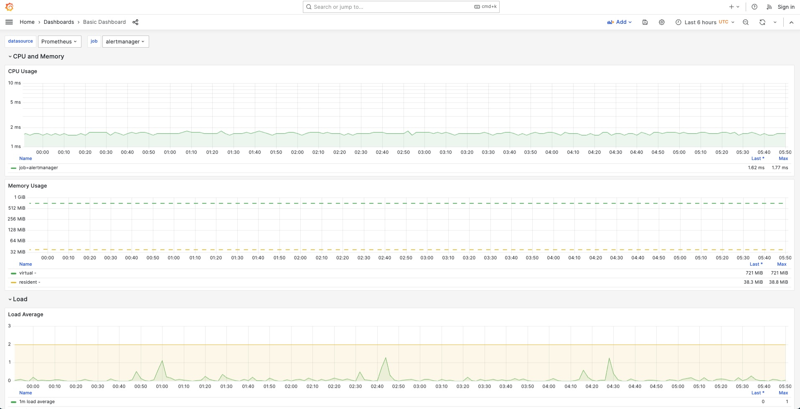

# grafana-dashboards-grafonnet-demo
Example generating Grafana Dashboards as Code using Grafonnet

## What is Grafonnet

[Grafonnet](https://github.com/grafana/grafonnet) is a [jsonnet](https://github.com/google/jsonnet) library for generating Grafana dashboards as code.

## Jsonnet and Libsonnet

**Jsonnet** is a data templating language that is designed to organize and simplify complex json data. Jsonnet allows for functions, variables, conditionals and other programming constructs which are not present in standard json.

**Libsonnet** files serve as libraries or modules within the jsonnet ecosystem. They are essentially Jsonnet files but are intended to be imported and reused across various other Jsonnet files.

The purposes of libsonnet files include:

- Modularity
- Organization
- Maintainability

## Definitions

- `g.libsonnet`: imports the grafonnet library.
- `panels.libsonnet`: defines the panels in our dashboard.
- `queries.libsonnet`: defines the queries within our panels.
- `variables.libsonnet`: defines the dashboard variables.
- `main.jsonnet`: the main jsonnet that brings everything together.
- `jsonnetfile.json`: the file that defines our dependencies.

## Demo

Compile the dashboards by specifying the path to additional library search directory `-J` the main jsonnet file and the output of where we want to generate the compiled json file:

```bash
jsonnet -J ./vendor main.jsonnet -o target/output.json
```

When we inspect the `target/output.json`` we can see that the dashboard json was generated and we can now import it into Grafana.

Screenshot:



## Grafana Stack

If you want to test this out you can use my Grafana repository to run grafana and prometheus on docker:

- https://github.com/ruanbekker/docker-monitoring-stack-gpnc

## Resources

- https://github.com/grafana/grafonnet
- https://github.com/google/jsonnet