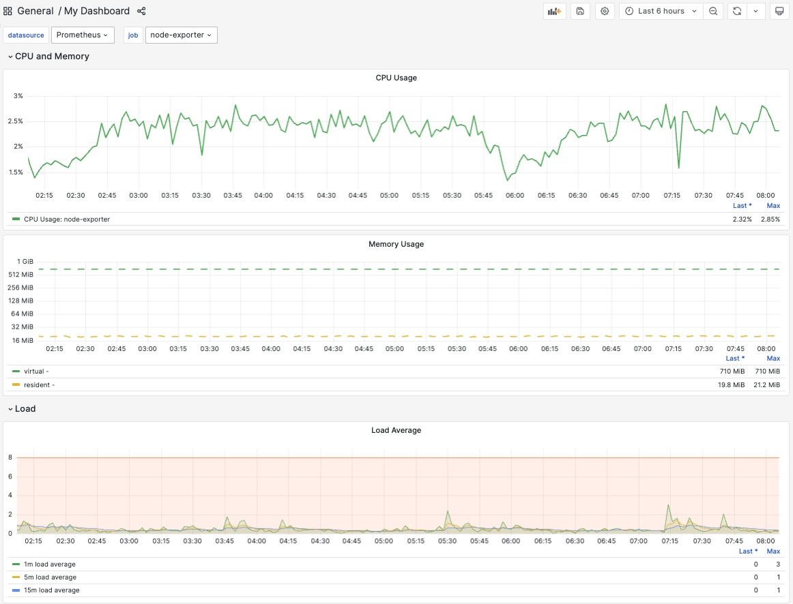

# functions-and-variables

Uses variables and functions to make the dashboard more dynamic.

## Usage

In `main.jsonnet` you can define your variables:

```jsonnet
local dashboard_name = 'My Dashboard';
local dashboard_uid = 'my-dashboard';
local dashboard_description = 'Dashboard generated with jsonnet';
local dashboard_timezone = 'browser';
local dashboard_tags = ['Basic', 'Jsonnet'];
```

And when you generate your dashboard json:

```bash
jsonnet -J ./vendor main.jsonnet -o dashboard.json
```

The dashboard json will be rendered with your input variables.

## Screenshot

